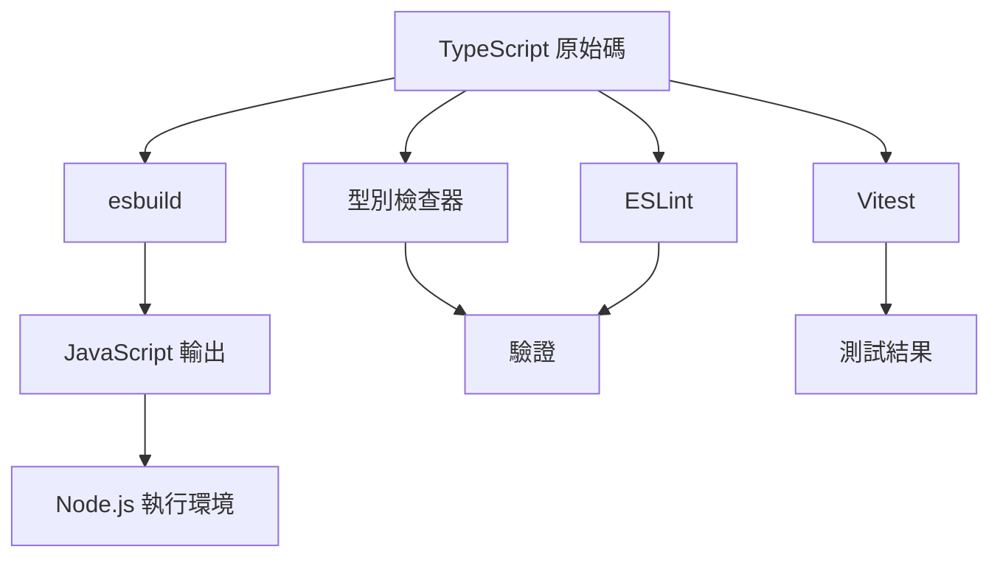
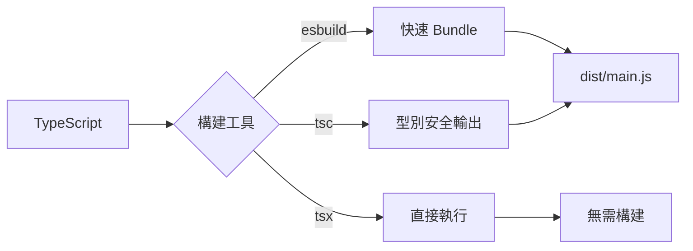

# app-esbuild - 完整文檔

## 📑 目錄

- [專案概述](#-專案概述)
- [核心特性](#-核心特性)
- [架構設計](#-架構設計)
- [開發指南](#-開發指南)
- [可用指令](#-可用指令)
- [配置說明](#-配置說明)
- [測試](#-測試)
- [構建與部署](#-構建與部署)
- [最佳實踐](#-最佳實踐)
- [故障排除](#-故障排除)
- [貢獻指南](#-貢獻指南)
- [授權條款](#-授權條款)

## 🎯 專案概述

### 什麼是 app-esbuild?

**app-esbuild** 是一個使用 [esbuild](https://esbuild.github.io/) 構建的生產就緒 TypeScript 應用程式模板。它提供超快的開發體驗和優化的生產構建,是啟動 Node.js 應用程式、CLI 工具、後端服務等專案的堅實基礎。

### 為什麼選擇 app-esbuild?

- **極速構建** - esbuild 的編譯速度比傳統工具快 10-100 倍
- **現代開發工作流** - 包含熱重載、型別檢查和完整測試
- **生產就緒** - 預先配置 Docker、CI/CD 和部署最佳實踐
- **開發者體驗** - 整合程式碼品質工具、文檔和 Git 工作流
- **靈活彈性** - 支援多種構建工具(esbuild/tsx/tsc)以適應不同需求

### 適用場景

此模板非常適合:

- **Node.js 應用程式** - 後端服務、API、微服務
- **CLI 工具** - 命令列工具和自動化腳本
- **構建工具** - 開發工具和構建管線
- **原型開發** - 快速應用程式開發和概念驗證
- **學習目的** - 理解現代 TypeScript 專案架構

## ✨ 核心特性

### 1. 超快速構建系統

**esbuild** 提供無與倫比的構建效能:

- **構建速度** - 毫秒級編譯
- **監聽模式** - 檔案變更後即時重建
- **Source Maps** - 完整的除錯支援
- **Bundle 優化** - Tree-shaking 和壓縮

典型專案的構建時間範例:
- 初始構建: ~50-100ms
- 增量重建: ~10-30ms

### 2. 多種構建選項

選擇適合您工作流程的構建工具:

```bash
# esbuild (最快,推薦用於開發)
pnpm dev:esbuild

# tsx (即時啟動,無需構建步驟)
pnpm dev:tsx

# TypeScript compiler (傳統方式)
pnpm dev:tsc
```

### 3. 完整測試支援

**Vitest** 提供快速且現代的測試體驗:

- **單元測試** - 測試個別函式和模組
- **E2E 測試** - 測試完整的應用程式工作流
- **覆蓋率報告** - Istanbul 覆蓋率整合
- **UI 模式** - 視覺化測試探索器

### 4. 程式碼品質自動化

預先配置的品質工具確保程式碼一致性:

- **ESLint** - JavaScript/TypeScript 程式碼檢查
- **Prettier** - 程式碼格式化
- **Husky** - Git hooks 自動化
- **lint-staged** - 提交前驗證

### 5. Docker 支援

多種 Dockerfile 配置:

```
docker/
├── Dockerfile.turbo          # Turbo 優化構建
└── Dockerfile.turbo.prune    # 精簡版 monorepo 構建
```

### 6. 文檔網站

內建 VitePress 文檔:

```bash
pnpm docs:dev    # 啟動文檔伺服器
pnpm docs:build  # 構建靜態文檔
```

### 7. 環境管理

**dotenv-flow** 用於環境特定配置:

```
.env.example      # 範本
.env.local        # 本地開發 (gitignored)
.env.development  # 開發環境
.env.production   # 生產環境
```

## 🏗️ 架構設計

### 技術堆疊



### 專案結構

```
app-esbuild/
├── src/                          # 原始碼
│   ├── main.ts                  # 應用程式入口點
│   ├── configs.ts               # 配置載入器
│   └── utils/                   # 工具模組
│       ├── index.ts            # Barrel export
│       └── demo/               # 示範工具
│           ├── index.ts
│           ├── getDemoValue.ts
│           └── getDemoValue.spec.ts
│
├── test/                        # E2E 測試
│   └── app.e2e-spec.ts         # 應用程式 E2E 測試
│
├── docs/                        # VitePress 文檔
│   ├── index.md                # 文檔首頁
│   ├── api-examples.md         # API 範例
│   └── markdown-examples.md    # Markdown 功能
│
├── scripts/                     # 構建腳本
│   └── devNodemonPlugin.ts     # Nodemon 整合插件
│
├── docker/                      # Docker 配置
│   ├── Dockerfile.turbo
│   └── Dockerfile.turbo.prune
│
├── esbuild.build.ts            # 生產構建配置
├── esbuild.dev.ts              # 開發構建配置
│
├── tsconfig.json               # 基礎 TypeScript 配置
├── tsconfig.app.json           # 應用程式配置
├── tsconfig.build.json         # 構建配置
├── tsconfig.spec.json          # 測試配置
│
├── vitest.config.mts           # 單元測試配置
├── vitest.config.e2e.mts       # E2E 測試配置
├── eslint.config.mjs           # ESLint 配置
│
├── .env.example                # 環境變數範本
├── .nvmrc                      # Node 版本
├── .prettierrc                 # Prettier 配置
├── commitlint.config.js        # Commit lint 配置
│
└── package.json                # 專案清單
```

### 模組架構

專案遵循清晰的架構模式:

1. **入口點** ([`main.ts`](../templates/app-esbuild/src/main.ts)) - 應用程式啟動
2. **配置** ([`configs.ts`](../templates/app-esbuild/src/configs.ts)) - 集中式配置管理
3. **工具** (`utils/`) - 可重用的函式和輔助工具
4. **測試** - 與原始碼同位置或在專用測試目錄

### 構建流程



## 🛠️ 開發指南

### 環境設置

#### 前置需求

1. **安裝 Node.js**:
   ```bash
   # 使用 nvm (推薦)
   nvm install 18
   nvm use 18
   
   # 或從 nodejs.org 下載
   ```

2. **安裝 pnpm**:
   ```bash
   npm install -g pnpm@10.24.0
   ```

3. **驗證安裝**:
   ```bash
   node --version  # 應該 >=18
   pnpm --version  # 應該 >=10.24.0
   ```

#### 專案設置

1. **複製或建立專案**:
   ```bash
   # 如果使用作為模板
   degit royfw/start-ts-templates/templates/app-esbuild my-app
   cd my-app
   ```

2. **安裝依賴**:
   ```bash
   pnpm install
   ```

3. **配置環境**:
   ```bash
   cp .env.example .env.local
   # 編輯 .env.local 設定您的配置
   ```

4. **驗證設置**:
   ```bash
   pnpm typecheck  # 檢查 TypeScript
   pnpm lint       # 檢查程式碼風格
   pnpm test       # 執行測試
   ```

### 開發工作流

#### 1. 功能開發

```bash
# 建立功能分支
git checkout -b feature/my-feature

# 啟動開發伺服器
pnpm dev

# 修改 src/ 中的程式碼
# 測試會在儲存時自動執行

# 執行型別檢查
pnpm typecheck:watch
```

#### 2. 撰寫程式碼

遵循 TypeScript 最佳實踐:

```typescript
// src/utils/myFeature.ts

/**
 * 計算兩個數字的和
 * @param a - 第一個數字
 * @param b - 第二個數字
 * @returns a 和 b 的和
 */
export function add(a: number, b: number): number {
  return a + b;
}
```

#### 3. 撰寫測試

建立同位置測試檔案:

```typescript
// src/utils/myFeature.spec.ts

import { describe, it, expect } from 'vitest';
import { add } from './myFeature';

describe('add', () => {
  it('應該正確地相加兩個數字', () => {
    expect(add(2, 3)).toBe(5);
  });
  
  it('應該處理負數', () => {
    expect(add(-1, 1)).toBe(0);
  });
});
```

#### 4. 提交變更

```bash
# 暫存變更
git add .

# 使用 Commitizen 提交 (強制執行 conventional commits)
pnpm commit

# 或手動提交 (必須遵循 conventional 格式)
git commit -m "feat: 新增新功能"
```

### 程式碼標準

#### TypeScript 配置

專案使用嚴格的 TypeScript 設定:

```json
{
  "compilerOptions": {
    "strict": true,
    "noUnusedLocals": true,
    "noFallthroughCasesInSwitch": true,
    "isolatedModules": true,
    "forceConsistentCasingInFileNames": true
  }
}
```

#### ESLint 規則

主要 linting 規則:

- 不允許未使用的變數
- 一致的型別導入
- 優先使用 const 而非 let
- 不允許顯式 any (使用 unknown 代替)

#### Prettier 格式化

自動格式化設定:

- 2 個空格縮排
- 單引號
- 尾隨逗號
- Unix 換行符號

### Git 工作流

#### 分支策略

- `main`: 生產就緒的程式碼
- `develop`: 整合分支
- `feature/*`: 新功能
- `bugfix/*`: 錯誤修復
- `hotfix/*`: 生產環境熱修復

#### 提交訊息

遵循 [Conventional Commits](https://www.conventionalcommits.org/):

```
feat: 新增使用者認證
fix: 解決資料庫連線問題
docs: 更新 API 文檔
style: 使用 prettier 格式化程式碼
refactor: 簡化錯誤處理
test: 新增認證模組的單元測試
chore: 更新依賴套件
```

## 📜 可用指令

### 開發指令

#### `pnpm dev`

啟動 esbuild watch 和型別檢查的開發模式:

```bash
pnpm dev
```

功能:
- 檔案變更時自動重建
- 並行型別檢查
- 啟用 source maps
- Nodemon 自動重啟

#### `pnpm dev:tsx`

使用 tsx 實現即時啟動(無需構建步驟):

```bash
pnpm dev:tsx
```

最適合:
- 快速測試
- 除錯
- REPL 風格開發

#### `pnpm dev:esbuild`

純 esbuild watch 模式:

```bash
pnpm dev:esbuild
```

活躍開發時效能最佳的選項。

#### `pnpm tsx`

直接執行 TypeScript:

```bash
pnpm tsx

# 或帶參數
npx tsx src/main.ts --port 3000
```

### 構建指令

#### `pnpm build`

使用 esbuild 進行生產構建:

```bash
pnpm build
```

輸出:
- `dist/` 中的優化 JavaScript
- 除錯用的 source maps
- 壓縮程式碼(如果配置)

#### `pnpm build:tsc`

使用 TypeScript compiler 構建:

```bash
pnpm build:tsc
```

適用於:
- 需要最大相容性
- 除錯構建問題
- 生成宣告檔案

#### `pnpm clean`

移除構建產物:

```bash
pnpm clean
```

### 測試指令

#### `pnpm test`

執行所有單元測試:

```bash
pnpm test

# 帶覆蓋率
pnpm vitest:run --coverage
```

#### `pnpm test:e2e`

執行端對端測試:

```bash
pnpm test:e2e
```

#### `pnpm vitest:ui`

啟動 Vitest UI:

```bash
pnpm vitest:ui
```

互動式測試探索器,包含:
- 視覺化測試結果
- 覆蓋率視覺化
- 效能指標

### 程式碼品質指令

#### `pnpm lint`

檢查程式碼風格:

```bash
pnpm lint

# 自動修復問題
pnpm lint:fix
```

#### `pnpm typecheck`

驗證 TypeScript 型別:

```bash
pnpm typecheck

# watch 模式
pnpm typecheck:watch
```

### 文檔指令

#### `pnpm docs:dev`

啟動文檔伺服器:

```bash
pnpm docs:dev
# 在 http://localhost:5173 開啟
```

#### `pnpm docs:build`

構建靜態文檔:

```bash
pnpm docs:build
# 輸出在 docs/.vitepress/dist
```

### 發布指令

#### `pnpm release`

自動版本升級和 changelog:

```bash
pnpm release

# 指定版本
pnpm release -- --release-as patch
pnpm release -- --release-as minor
pnpm release -- --release-as major
```

自動執行:
- 升級 package.json 中的版本
- 更新 CHANGELOG.md
- 建立 git tag
- 提交變更

## ⚙️ 配置說明

### TypeScript 配置

#### 基礎配置 ([`tsconfig.json`](../templates/app-esbuild/tsconfig.json))

```json
{
  "compilerOptions": {
    "target": "ES2023",
    "module": "ESNext",
    "moduleResolution": "bundler",
    "strict": true,
    "esModuleInterop": true,
    "resolveJsonModule": true,
    "sourceMap": true,
    "outDir": "./dist",
    "paths": {
      "@/*": ["./src/*"]
    }
  }
}
```

關鍵設定說明:

- **target: ES2023** - 使用現代 JavaScript 特性
- **module: ESNext** - 最新的模組系統
- **moduleResolution: bundler** - 為打包工具優化
- **strict: true** - 最大型別安全
- **paths** - 路徑別名 (@ = src/)

#### 構建配置 ([`tsconfig.build.json`](../templates/app-esbuild/tsconfig.build.json))

擴展基礎配置用於生產構建:
- 排除測試檔案
- 啟用宣告生成(如需要)

#### 測試配置 ([`tsconfig.spec.json`](../templates/app-esbuild/tsconfig.spec.json))

包含測試工具和型別:
- Vitest 型別
- 測試輔助工具

### esbuild 配置

#### 開發構建 ([`esbuild.dev.ts`](../templates/app-esbuild/esbuild.dev.ts))

```typescript
import esbuild from 'esbuild';

esbuild.build({
  entryPoints: ['src/main.ts'],
  bundle: true,
  platform: 'node',
  target: 'node18',
  outdir: 'dist',
  format: 'cjs',
  sourcemap: true,
  watch: {
    onRebuild(error, result) {
      // 處理重建
    },
  },
  plugins: [
    // 自定義插件
  ],
}).catch(() => process.exit(1));
```

功能:
- 啟用 watch 模式
- 除錯用 source maps
- 自定義行為的插件系統

#### 生產構建 ([`esbuild.build.ts`](../templates/app-esbuild/esbuild.build.ts))

生產環境優化:
- 啟用壓縮
- Tree-shaking
- 無 watch 模式

### Vitest 配置

#### 單元測試 ([`vitest.config.mts`](../templates/app-esbuild/vitest.config.mts))

```typescript
import { defineConfig } from 'vitest/config';

export default defineConfig({
  test: {
    globals: true,
    environment: 'node',
    coverage: {
      provider: 'istanbul',
      reporter: ['text', 'json', 'html'],
    },
  },
});
```

#### E2E 測試 ([`vitest.config.e2e.mts`](../templates/app-esbuild/vitest.config.e2e.mts))

整合測試的獨立配置。

### ESLint 配置

現代 flat config 格式 ([`eslint.config.mjs`](../templates/app-esbuild/eslint.config.mjs)):

```javascript
import eslint from '@eslint/js';
import tseslint from 'typescript-eslint';

export default tseslint.config(
  eslint.configs.recommended,
  ...tseslint.configs.recommended,
  {
    rules: {
      // 自定義規則
    },
  }
);
```

### 環境變數

使用 **dotenv-flow** 管理環境特定配置:

```typescript
// src/configs.ts
import dotenvFlow from 'dotenv-flow';

dotenvFlow.config();

export const config = {
  port: process.env.PORT || 3000,
  nodeEnv: process.env.NODE_ENV || 'development',
  // 在此新增您的配置
};
```

環境檔案優先順序:
1. `.env.local` (最高優先級, gitignored)
2. `.env.{NODE_ENV}`
3. `.env`

## 🧪 測試

### 測試策略

#### 測試金字塔

```
      /\
     /E2E\       <- 少量,高層級
    /------\
   /  整合  \    <- 適量,中層級  
  /----------\
 /   單元     \  <- 大量,低層級
/--------------\
```

- **單元測試**: 70% - 測試個別函式
- **整合測試**: 20% - 測試模組互動
- **E2E 測試**: 10% - 測試完整工作流

### 撰寫單元測試

單元測試範例:

```typescript
// src/utils/demo/getDemoValue.spec.ts
import { describe, it, expect } from 'vitest';
import { getDemoValue } from './getDemoValue';

describe('getDemoValue', () => {
  it('應該返回示範值', () => {
    const result = getDemoValue();
    expect(result).toBe('demo');
  });

  it('應該處理邊界情況', () => {
    // 測試邊界情況
  });
});
```

### 撰寫 E2E 測試

E2E 測試範例:

```typescript
// test/app.e2e-spec.ts
import { describe, it, expect, beforeAll, afterAll } from 'vitest';

describe('Application E2E', () => {
  beforeAll(async () => {
    // 設置
  });

  afterAll(async () => {
    // 清理
  });

  it('應該成功啟動', async () => {
    // 測試應用程式啟動
  });
});
```

### 執行測試

```bash
# 執行所有測試
pnpm test

# 執行特定測試檔案
pnpm vitest run src/utils/demo/getDemoValue.spec.ts

# 執行匹配模式的測試
pnpm vitest run --grep "應該處理"

# 帶覆蓋率執行
pnpm vitest run --coverage

# Watch 模式
pnpm vitest
```

### 測試覆蓋率

查看覆蓋率報告:

```bash
pnpm vitest run --coverage
# 在 coverage/index.html 開啟 HTML 報告
```

覆蓋率目標:
- 語句: >80%
- 分支: >75%
- 函式: >80%
- 行數: >80%

## 🚀 構建與部署

### 生產構建

#### 標準構建

```bash
# 清理先前的構建
pnpm clean

# 使用 esbuild 構建
pnpm build

# 驗證構建
node dist/main.js
```

#### TypeScript 構建

為了最大相容性:

```bash
pnpm build:tsc
```

### Docker 部署

#### 基本 Dockerfile

```dockerfile
FROM node:18-alpine

WORKDIR /app

COPY package.json pnpm-lock.yaml ./
RUN npm install -g pnpm@10.24.0
RUN pnpm install --frozen-lockfile

COPY . .
RUN pnpm build

CMD ["node", "dist/main.js"]
```

#### 構建和執行

```bash
# 構建映像
docker build -t app-esbuild .

# 執行容器
docker run -p 3000:3000 app-esbuild
```

#### Turbo 優化

使用 Turborepo 加速構建:

```bash
docker build -f docker/Dockerfile.turbo -t app-esbuild:turbo .
```

### 部署平台

#### Node.js 伺服器

```bash
# 安裝依賴
pnpm install --prod

# 構建
pnpm build

# 使用 PM2 執行
pm2 start dist/main.js --name app-esbuild
```

#### Serverless (AWS Lambda 等)

修改 esbuild 配置用於 serverless:

```typescript
{
  platform: 'node',
  target: 'node18',
  bundle: true,
  minify: true,
  external: ['aws-sdk'], // 排除執行環境依賴
}
```

#### 容器平台 (Kubernetes, Cloud Run)

使用提供的 Dockerfiles:
- 多階段構建
- 最小化基礎映像
- 安全最佳實踐

### 效能優化

#### 構建優化

1. **啟用壓縮**:
   ```typescript
   {
     minify: true,
     treeShaking: true,
   }
   ```

2. **外部依賴**:
   ```typescript
   {
     external: ['express', 'lodash'], // 不打包大型依賴
   }
   ```

3. **程式碼分割**:
   ```typescript
   {
     splitting: true,
     format: 'esm',
   }
   ```

#### 執行環境優化

1. **使用生產環境 Node**:
   ```bash
   NODE_ENV=production node dist/main.js
   ```

2. **啟用叢集**:
   ```typescript
   import cluster from 'cluster';
   import os from 'os';
   
   if (cluster.isPrimary) {
     for (let i = 0; i < os.cpus().length; i++) {
       cluster.fork();
     }
   } else {
     // 啟動應用程式
   }
   ```

## 💡 最佳實踐

### 程式碼組織

#### 1. 模組結構

```typescript
// 良好: 清晰的關注點分離
src/
├── features/
│   ├── auth/
│   │   ├── auth.service.ts
│   │   ├── auth.controller.ts
│   │   └── auth.spec.ts
│   └── users/
│       ├── users.service.ts
│       └── users.spec.ts
└── shared/
    └── utils/
```

#### 2. Barrel Exports

```typescript
// src/utils/index.ts
export * from './demo';
export * from './validation';
export * from './formatting';
```

### TypeScript 最佳實踐

#### 1. 避免 `any`

```typescript
// 不良
function process(data: any) { }

// 良好
function process(data: unknown) {
  if (typeof data === 'string') {
    // 型別縮窄
  }
}
```

#### 2. 使用 Const 斷言

```typescript
// 推斷字面量型別
const config = {
  api: 'https://api.example.com',
  timeout: 5000,
} as const;
```

#### 3. 物件優先使用 Interfaces

```typescript
// 良好的擴展性
interface User {
  id: string;
  name: string;
}

// 良好的聯合型別
type Status = 'pending' | 'active' | 'inactive';
```

### 錯誤處理

#### 1. 自定義錯誤類別

```typescript
export class ApplicationError extends Error {
  constructor(
    message: string,
    public code: string,
    public statusCode: number = 500
  ) {
    super(message);
    this.name = 'ApplicationError';
  }
}
```

#### 2. 集中式錯誤處理器

```typescript
process.on('unhandledRejection', (error: Error) => {
  console.error('未處理的 Rejection:', error);
  process.exit(1);
});
```

### 效能技巧

#### 1. 延遲載入

```typescript
// 僅在需要時載入重量級模組
const heavyModule = await import('./heavy-module');
```

#### 2. 快取

```typescript
const cache = new Map();

function expensiveOperation(key: string) {
  if (cache.has(key)) {
    return cache.get(key);
  }
  const result = /* 昂貴的計算 */;
  cache.set(key, result);
  return result;
}
```

## 🐛 故障排除

### 常見問題

#### 構建錯誤

**問題**: `Cannot find module '@/utils'`

**解決方案**: 檢查 `tsconfig.json` 中的路徑別名:
```json
{
  "paths": {
    "@/*": ["./src/*"]
  }
}
```

對於 esbuild,配置插件或使用絕對導入。

---

**問題**: `esbuild: Build failed`

**解決方案**: 檢查 `esbuild.build.ts` 配置並確保所有依賴已安裝。

#### 型別錯誤

**問題**: `Type 'X' is not assignable to type 'Y'`

**解決方案**: 
1. 執行 `pnpm typecheck` 查看完整錯誤上下文
2. 檢查 TypeScript 版本相容性
3. 驗證 `tsconfig.json` 設定

#### 測試失敗

**問題**: 測試在本地通過但在 CI 中失敗

**解決方案**:
1. 檢查環境變數
2. 確保測試資料具確定性
3. 在 CI 中使用 `--no-threads` 標誌

#### 執行環境錯誤

**問題**: 生產環境中出現 `MODULE_NOT_FOUND`

**解決方案**:
1. 驗證所有依賴都在 `dependencies` 中(不是 `devDependencies`)
2. 檢查 `esbuild.build.ts` 中的 bundle 配置
3. 生產環境使用 `pnpm install --prod`

### 除錯模式

啟用詳細日誌:

```bash
# Node.js 除錯
NODE_ENV=development DEBUG=* node dist/main.js

# Source map 除錯
node --enable-source-maps dist/main.js
```

### 尋求協助

- 查看 [GitHub Issues](https://github.com/royfw/start-ts-templates/issues)
- 查閱 [esbuild 文檔](https://esbuild.github.io/)
- 在專案討論區發問

## 🤝 貢獻指南

### 開發設置

1. Fork 並 clone 儲存庫
2. 安裝依賴: `pnpm install`
3. 建立功能分支: `git checkout -b feature/my-feature`
4. 進行變更
5. 執行測試: `pnpm test`
6. 提交: `pnpm commit`
7. 推送並建立 Pull Request

### 程式碼審查指南

- 遵循現有的程式碼風格
- 為新功能新增測試
- 更新文檔
- 保持提交原子化且描述清楚

### 發布流程

維護者遵循以下流程:

1. 更新版本: `pnpm release`
2. 審查 CHANGELOG.md
3. 推送標籤: `git push --follow-tags`
4. 建立 GitHub release

## 📄 授權條款

本專案採用 ISC 授權條款。

---

**建立者** [start-ts-templates](https://github.com/royfw/start-ts-templates)

更多模板請查看 [模板集合](https://github.com/royfw/start-ts-templates/tree/main/templates)。