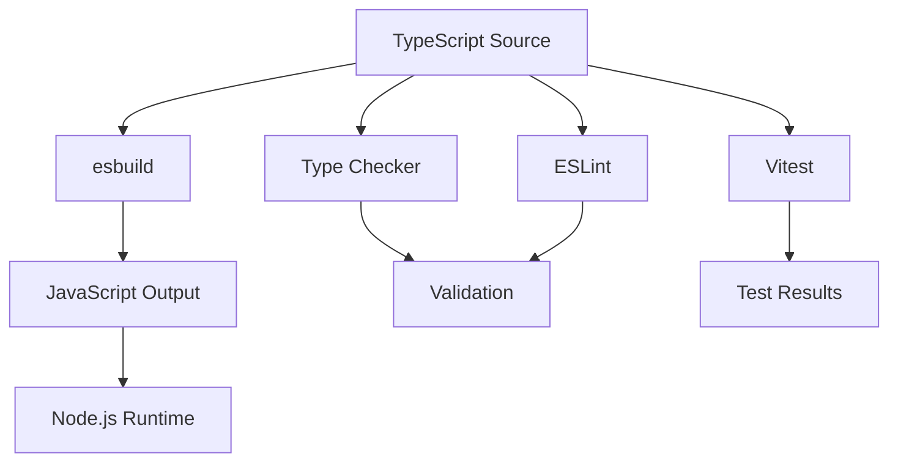
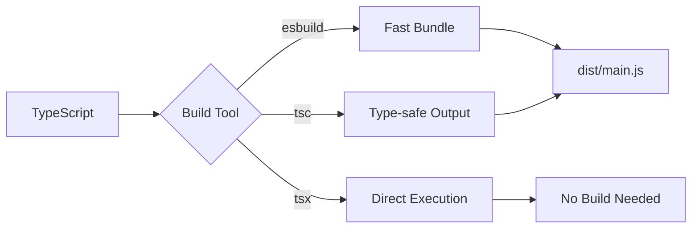

# app-esbuild - Complete Documentation

## 📑 Table of Contents

- [Project Overview](#-project-overview)
- [Core Features](#-core-features)
- [Architecture](#-architecture)
- [Development Guide](#-development-guide)
- [Available Scripts](#-available-scripts)
- [Configuration](#-configuration)
- [Testing](#-testing)
- [Build & Deployment](#-build--deployment)
- [Best Practices](#-best-practices)
- [Troubleshooting](#-troubleshooting)
- [Contributing](#-contributing)
- [License](#-license)

## 🎯 Project Overview

### What is app-esbuild?

**app-esbuild** is a production-ready TypeScript application template built with [esbuild](https://esbuild.github.io/), the extremely fast JavaScript bundler. It provides lightning-fast development experience and optimized production builds, making it a solid foundation for starting Node.js applications, CLI tools, backend services, and more.

### Why Choose app-esbuild?

- **Lightning Fast** - esbuild compiles 10-100x faster than traditional tools
- **Modern Development Workflow** - Hot reload, type checking, and comprehensive testing
- **Production Ready** - Pre-configured Docker, CI/CD, and deployment best practices
- **Developer Experience** - Integrated code quality tools, documentation, and Git workflow
- **Flexible** - Support multiple build tools (esbuild/tsx/tsc) for different needs

### Use Cases

This template is ideal for:

- **Node.js Applications** - Backend services, APIs, microservices
- **CLI Tools** - Command-line tools and automation scripts
- **Build Tools** - Development tools and build pipelines
- **Prototyping** - Rapid application development and proof of concepts
- **Learning** - Understanding modern TypeScript project architecture

## ✨ Core Features

### 1. Extremely Fast Build System

**esbuild** provides unparalleled build performance:

- **Build Speed** - Millisecond-level compilation
- **Watch Mode** - Instant rebuild on file changes
- **Source Maps** - Full debugging support
- **Bundle Optimization** - Tree-shaking and minification

Typical project build times:
- Initial build: ~50-100ms
- Incremental rebuild: ~10-30ms

### 2. Multiple Build Options

Choose the build tool that fits your workflow:

```bash
# esbuild (fastest, recommended for development)
pnpm dev:esbuild

# tsx (instant start, no build step)
pnpm dev:tsx

# TypeScript compiler (traditional approach)
pnpm dev:tsc
```

### 3. Comprehensive Testing

**Vitest** provides fast and modern testing experience:

- **Unit Tests** - Test individual functions and modules
- **E2E Tests** - Test complete application workflows
- **Coverage Reports** - Istanbul coverage integration
- **UI Mode** - Visual test explorer

### 4. Code Quality Automation

Pre-configured quality tools ensure code consistency:

- **ESLint** - JavaScript/TypeScript linting
- **Prettier** - Code formatting
- **Husky** - Git hooks automation
- **lint-staged** - Pre-commit validation

### 5. Docker Support

Multiple Dockerfile configurations:

```
docker/
├── Dockerfile.turbo          # Turbo-optimized build
└── Dockerfile.turbo.prune    # Lightweight monorepo build
```

### 6. Documentation Site

Built-in VitePress documentation:

```bash
pnpm docs:dev    # Start documentation server
pnpm docs:build  # Build static documentation
```

### 7. Environment Management

**dotenv-flow** for environment-specific configuration:

```
.env.example      # Template
.env.local        # Local development (gitignored)
.env.development  # Development environment
.env.production   # Production environment
```

## 🏗️ Architecture

### Technology Stack



### Project Structure

```
app-esbuild/
├── src/                          # Source code
│   ├── main.ts                  # Application entry point
│   ├── configs.ts               # Configuration loader
│   └── utils/                   # Utility modules
│       ├── index.ts            # Barrel export
│       └── demo/               # Demo utilities
│           ├── index.ts
│           ├── getDemoValue.ts
│           └── getDemoValue.spec.ts
│
├── test/                        # E2E tests
│   └── app.e2e-spec.ts         # Application E2E tests
│
├── docs/                        # VitePress documentation
│   ├── index.md                # Documentation home
│   ├── api-examples.md         # API examples
│   └── markdown-examples.md    # Markdown features
│
├── scripts/                     # Build scripts
│   └── devNodemonPlugin.ts     # Nodemon integration plugin
│
├── docker/                      # Docker configurations
│   ├── Dockerfile.turbo
│   └── Dockerfile.turbo.prune
│
├── esbuild.build.ts            # Production build config
├── esbuild.dev.ts              # Development build config
│
├── tsconfig.json               # Base TypeScript config
├── tsconfig.app.json           # Application config
├── tsconfig.build.json         # Build config
├── tsconfig.spec.json          # Test config
│
├── vitest.config.mts           # Unit test config
├── vitest.config.e2e.mts       # E2E test config
├── eslint.config.mjs           # ESLint config
│
├── .env.example                # Environment variables template
├── .nvmrc                      # Node version
├── .prettierrc                 # Prettier config
├── commitlint.config.js        # Commit lint config
│
└── package.json                # Package manifest
```

### Module Architecture

The project follows clear architectural patterns:

1. **Entry Point** (`main.ts`) - Application startup
2. **Configuration** (`configs.ts`) - Centralized configuration management
3. **Utilities** (`utils/`) - Reusable functions and helpers
4. **Tests** - Co-located with source or in dedicated test directory

### Build Flow



## 🛠️ Development Guide

### Environment Setup

#### Prerequisites

1. **Install Node.js**:
   ```bash
   # Using nvm (recommended)
   nvm install 18
   nvm use 18
   
   # Or download from nodejs.org
   ```

2. **Install pnpm**:
   ```bash
   npm install -g pnpm@10.24.0
   ```

3. **Verify Installation**:
   ```bash
   node --version  # Should be >=18
   pnpm --version  # Should be >=10.24.0
   ```

#### Project Setup

1. **Clone or Create Project**:
   ```bash
   # If using as template
   degit royfw/rfjs/templates/apps/app-esbuild my-app
   cd my-app
   ```

2. **Install Dependencies**:
   ```bash
   pnpm install
   ```

3. **Configure Environment**:
   ```bash
   cp .env.example .env.local
   # Edit .env.local to set your configuration
   ```

4. **Verify Setup**:
   ```bash
   pnpm typecheck  # Check TypeScript
   pnpm lint       # Check code style
   pnpm test       # Run tests
   ```

### Development Workflow

#### 1. Feature Development

```bash
# Create feature branch
git checkout -b feature/my-feature

# Start development server
pnpm dev

# Make changes to src/
# Tests run automatically on save

# Run type checking
pnpm typecheck:watch
```

#### 2. Writing Code

Follow TypeScript best practices:

```typescript
// src/utils/myFeature.ts

/**
 * Calculate the sum of two numbers
 * @param a - First number
 * @param b - Second number
 * @returns The sum of a and b
 */
export function add(a: number, b: number): number {
  return a + b;
}
```

#### 3. Writing Tests

Create co-located test files:

```typescript
// src/utils/myFeature.spec.ts

import { describe, it, expect } from 'vitest';
import { add } from './myFeature';

describe('add', () => {
  it('should correctly add two numbers', () => {
    expect(add(2, 3)).toBe(5);
  });
  
  it('should handle negative numbers', () => {
    expect(add(-1, 1)).toBe(0);
  });
});
```

#### 4. Committing Changes

```bash
# Stage changes
git add .

# Commit using Commitizen (enforces conventional commits)
pnpm commit

# Or manual commit (must follow conventional format)
git commit -m "feat: add new feature"
```

### Code Standards

#### TypeScript Configuration

Project uses strict TypeScript settings:

```json
{
  "compilerOptions": {
    "strict": true,
    "noUnusedLocals": true,
    "noFallthroughCasesInSwitch": true,
    "isolatedModules": true,
    "forceConsistentCasingInFileNames": true
  }
}
```

#### ESLint Rules

Key linting rules:

- No unused variables
- Consistent type imports
- Prefer const over let
- No explicit any (use unknown instead)

#### Prettier Formatting

Automated formatting settings:

- 2 space indentation
- Single quotes
- Trailing commas
- Unix line endings

### Git Workflow

#### Branch Strategy

- `main`: Production-ready code
- `develop`: Integration branch
- `feature/*`: New features
- `bugfix/*`: Bug fixes
- `hotfix/*`: Production hotfixes

#### Commit Messages

Follow [Conventional Commits](https://www.conventionalcommits.org/):

```
feat: add user authentication
fix: resolve database connection issue
docs: update API documentation
style: format code with prettier
refactor: simplify error handling
test: add unit tests for auth module
chore: update dependencies
```

## 📜 Available Scripts

### Development Scripts

#### `pnpm dev`

Start development mode with esbuild watch and type checking:

```bash
pnpm dev
```

Features:
- Automatic rebuild on file changes
- Parallel type checking
- Source maps enabled
- Nodemon auto-restart

#### `pnpm dev:tsx`

Instant start with tsx (no build step):

```bash
pnpm dev:tsx
```

Best for:
- Quick testing
- Debugging
- REPL-style development

#### `pnpm dev:esbuild`

Pure esbuild watch mode:

```bash
pnpm dev:esbuild
```

Best performance option for active development.

#### `pnpm tsx`

Execute TypeScript directly:

```bash
pnpm tsx

# Or with arguments
npx tsx src/main.ts --port 3000
```

### Build Scripts

#### `pnpm build`

Production build with esbuild:

```bash
pnpm build
```

Output:
- Optimized JavaScript in `dist/`
- Source maps for debugging
- Minified code (if configured)

#### `pnpm build:tsc`

Build with TypeScript compiler:

```bash
pnpm build:tsc
```

Use when:
- Maximum compatibility needed
- Debugging build issues
- Generating declaration files

#### `pnpm clean`

Remove build artifacts:

```bash
pnpm clean
```

### Testing Scripts

#### `pnpm test`

Run all unit tests:

```bash
pnpm test

# With coverage
pnpm vitest:run --coverage
```

#### `pnpm test:e2e`

Run end-to-end tests:

```bash
pnpm test:e2e
```

#### `pnpm vitest:ui`

Launch Vitest UI:

```bash
pnpm vitest:ui
```

Interactive test explorer with:
- Visual test results
- Coverage visualization
- Performance metrics

### Code Quality Scripts

#### `pnpm lint`

Check code style:

```bash
pnpm lint

# Auto-fix issues
pnpm lint:fix
```

#### `pnpm typecheck`

Verify TypeScript types:

```bash
pnpm typecheck

# Watch mode
pnpm typecheck:watch
```

### Documentation Scripts

#### `pnpm docs:dev`

Start documentation server:

```bash
pnpm docs:dev
# Opens at http://localhost:5173
```

#### `pnpm docs:build`

Build static documentation:

```bash
pnpm docs:build
# Output in docs/.vitepress/dist
```

### Release Scripts

#### `pnpm release`

Automated version bump and changelog:

```bash
pnpm release

# Specify version
pnpm release -- --release-as patch
pnpm release -- --release-as minor
pnpm release -- --release-as major
```

Automatically:
- Bumps version in package.json
- Updates CHANGELOG.md
- Creates git tag
- Commits changes

## ⚙️ Configuration

### TypeScript Configuration

#### Base Config (`tsconfig.json`)

```json
{
  "compilerOptions": {
    "target": "ES2023",
    "module": "ESNext",
    "moduleResolution": "bundler",
    "strict": true,
    "esModuleInterop": true,
    "resolveJsonModule": true,
    "sourceMap": true,
    "outDir": "./dist",
    "paths": {
      "@/*": ["./src/*"]
    }
  }
}
```

Key settings:

- **target: ES2023** - Use modern JavaScript features
- **module: ESNext** - Latest module system
- **moduleResolution: bundler** - Optimized for bundlers
- **strict: true** - Maximum type safety
- **paths** - Path aliases (@ = src/)

#### Build Config (`tsconfig.build.json`)

Extends base config for production builds:
- Excludes test files
- Enables declaration generation (if needed)

#### Test Config (`tsconfig.spec.json`)

Includes test utilities and types:
- Vitest types
- Test helpers

### esbuild Configuration

#### Development Build (`esbuild.dev.ts`)

```typescript
import esbuild from 'esbuild';

esbuild.build({
  entryPoints: ['src/main.ts'],
  bundle: true,
  platform: 'node',
  target: 'node18',
  outdir: 'dist',
  format: 'cjs',
  sourcemap: true,
  watch: {
    onRebuild(error, result) {
      // Handle rebuild
    },
  },
  plugins: [
    // Custom plugins
  ],
}).catch(() => process.exit(1));
```

Features:
- Watch mode enabled
- Source maps for debugging
- Plugin system for custom behavior

#### Production Build (`esbuild.build.ts`)

Production optimizations:
- Minification enabled
- Tree-shaking
- No watch mode

### Vitest Configuration

#### Unit Tests (`vitest.config.mts`)

```typescript
import { defineConfig } from 'vitest/config';

export default defineConfig({
  test: {
    globals: true,
    environment: 'node',
    coverage: {
      provider: 'istanbul',
      reporter: ['text', 'json', 'html'],
    },
  },
});
```

#### E2E Tests (`vitest.config.e2e.mts`)

Separate configuration for integration tests.

### ESLint Configuration

Modern flat config format (`eslint.config.mjs`):

```javascript
import eslint from '@eslint/js';
import tseslint from 'typescript-eslint';

export default tseslint.config(
  eslint.configs.recommended,
  ...tseslint.configs.recommended,
  {
    rules: {
      // Custom rules
    },
  }
);
```

### Environment Variables

Use **dotenv-flow** for environment-specific configuration:

```typescript
// src/configs.ts
import dotenvFlow from 'dotenv-flow';

dotenvFlow.config();

export const config = {
  port: process.env.PORT || 3000,
  nodeEnv: process.env.NODE_ENV || 'development',
  // Add your config here
};
```

Environment file priority:
1. `.env.local` (highest priority, gitignored)
2. `.env.{NODE_ENV}`
3. `.env`

## 🧪 Testing

### Testing Strategy

#### Test Pyramid

```
      /\
     /E2E\       <- Few, high-level
    /------\
   /  Integ  \    <- Some, mid-level  
  /----------\
 /   Unit     \  <- Many, low-level
/--------------\
```

- **Unit Tests**: 70% - Test individual functions
- **Integration Tests**: 20% - Test module interactions
- **E2E Tests**: 10% - Test complete workflows

### Writing Unit Tests

Unit test example:

```typescript
// src/utils/demo/getDemoValue.spec.ts
import { describe, it, expect } from 'vitest';
import { getDemoValue } from './getDemoValue';

describe('getDemoValue', () => {
  it('should return demo value', () => {
    const result = getDemoValue();
    expect(result).toBe('demo');
  });

  it('should handle edge cases', () => {
    // Test edge cases
  });
});
```

### Writing E2E Tests

E2E test example:

```typescript
// test/app.e2e-spec.ts
import { describe, it, expect, beforeAll, afterAll } from 'vitest';

describe('Application E2E', () => {
  beforeAll(async () => {
    // Setup
  });

  afterAll(async () => {
    // Cleanup
  });

  it('should start successfully', async () => {
    // Test application startup
  });
});
```

### Running Tests

```bash
# Run all tests
pnpm test

# Run specific test file
pnpm vitest run src/utils/demo/getDemoValue.spec.ts

# Run tests matching pattern
pnpm vitest run --grep "should handle"

# Run with coverage
pnpm vitest run --coverage

# Watch mode
pnpm vitest
```

### Test Coverage

View coverage reports:

```bash
pnpm vitest run --coverage
# Open HTML report at coverage/index.html
```

Coverage goals:
- Statements: >80%
- Branches: >75%
- Functions: >80%
- Lines: >80%

## 🚀 Build & Deployment

### Production Build

#### Standard Build

```bash
# Clean previous builds
pnpm clean

# Build with esbuild
pnpm build

# Verify build
node dist/main.js
```

#### TypeScript Build

For maximum compatibility:

```bash
pnpm build:tsc
```

### Docker Deployment

#### Basic Dockerfile

```dockerfile
FROM node:18-alpine

WORKDIR /app

COPY package.json pnpm-lock.yaml ./
RUN npm install -g pnpm@10.24.0
RUN pnpm install --frozen-lockfile

COPY . .
RUN pnpm build

CMD ["node", "dist/main.js"]
```

#### Build and Run

```bash
# Build image
docker build -t app-esbuild .

# Run container
docker run -p 3000:3000 app-esbuild
```

#### Turbo Optimization

Use Turborepo for faster builds:

```bash
docker build -f docker/Dockerfile.turbo -t app-esbuild:turbo .
```

### Deployment Platforms

#### Node.js Server

```bash
# Install dependencies
pnpm install --prod

# Build
pnpm build

# Run with PM2
pm2 start dist/main.js --name app-esbuild
```

#### Serverless (AWS Lambda, etc.)

Modify esbuild config for serverless:

```typescript
{
  platform: 'node',
  target: 'node18',
  bundle: true,
  minify: true,
  external: ['aws-sdk'], // Exclude runtime dependencies
}
```

#### Container Platforms (Kubernetes, Cloud Run)

Use provided Dockerfiles:
- Multi-stage builds
- Minimal base images
- Security best practices

### Performance Optimization

#### Build Optimization

1. **Enable Minification**:
   ```typescript
   {
     minify: true,
     treeShaking: true,
   }
   ```

2. **External Dependencies**:
   ```typescript
   {
     external: ['express', 'lodash'], // Don't bundle large dependencies
   }
   ```

3. **Code Splitting**:
   ```typescript
   {
     splitting: true,
     format: 'esm',
   }
   ```

#### Runtime Optimization

1. **Use Production Node**:
   ```bash
   NODE_ENV=production node dist/main.js
   ```

2. **Enable Clustering**:
   ```typescript
   import cluster from 'cluster';
   import os from 'os';
   
   if (cluster.isPrimary) {
     for (let i = 0; i < os.cpus().length; i++) {
       cluster.fork();
     }
   } else {
     // Start application
   }
   ```

## 💡 Best Practices

### Code Organization

#### 1. Module Structure

```typescript
// Good: Clear separation of concerns
src/
├── features/
│   ├── auth/
│   │   ├── auth.service.ts
│   │   ├── auth.controller.ts
│   │   └── auth.spec.ts
│   └── users/
│       ├── users.service.ts
│       └── users.spec.ts
└── shared/
    └── utils/
```

#### 2. Barrel Exports

```typescript
// src/utils/index.ts
export * from './demo';
export * from './validation';
export * from './formatting';
```

### TypeScript Best Practices

#### 1. Avoid `any`

```typescript
// Bad
function process(data: any) { }

// Good
function process(data: unknown) {
  if (typeof data === 'string') {
    // Type narrowing
  }
}
```

#### 2. Use Const Assertions

```typescript
// Infer literal types
const config = {
  api: 'https://api.example.com',
  timeout: 5000,
} as const;
```

#### 3. Prefer Interfaces for Objects

```typescript
// Good for extensibility
interface User {
  id: string;
  name: string;
}

// Good for union types
type Status = 'pending' | 'active' | 'inactive';
```

### Error Handling

#### 1. Custom Error Classes

```typescript
export class ApplicationError extends Error {
  constructor(
    message: string,
    public code: string,
    public statusCode: number = 500
  ) {
    super(message);
    this.name = 'ApplicationError';
  }
}
```

#### 2. Centralized Error Handler

```typescript
process.on('unhandledRejection', (error: Error) => {
  console.error('Unhandled Rejection:', error);
  process.exit(1);
});
```

### Performance Tips

#### 1. Lazy Loading

```typescript
// Load heavy modules only when needed
const heavyModule = await import('./heavy-module');
```

#### 2. Caching

```typescript
const cache = new Map();

function expensiveOperation(key: string) {
  if (cache.has(key)) {
    return cache.get(key);
  }
  const result = /* expensive computation */;
  cache.set(key, result);
  return result;
}
```

## 🐛 Troubleshooting

### Common Issues

#### Build Errors

**Issue**: `Cannot find module '@/utils'`

**Solution**: Check path aliases in `tsconfig.json`:
```json
{
  "paths": {
    "@/*": ["./src/*"]
  }
}
```

For esbuild, configure plugins or use absolute imports.

---

**Issue**: `esbuild: Build failed`

**Solution**: Check `esbuild.build.ts` configuration and ensure all dependencies are installed.

#### Type Errors

**Issue**: `Type 'X' is not assignable to type 'Y'`

**Solution**: 
1. Run `pnpm typecheck` to see full error context
2. Check TypeScript version compatibility
3. Verify `tsconfig.json` settings

#### Test Failures

**Issue**: Tests pass locally but fail in CI

**Solution**:
1. Check environment variables
2. Ensure test data is deterministic
3. Use `--no-threads` flag in CI

#### Runtime Errors

**Issue**: `MODULE_NOT_FOUND` in production

**Solution**:
1. Verify all dependencies are in `dependencies` (not `devDependencies`)
2. Check bundle configuration in `esbuild.build.ts`
3. Use `pnpm install --prod` for production

### Debug Mode

Enable verbose logging:

```bash
# Node.js debugging
NODE_ENV=development DEBUG=* node dist/main.js

# Source map debugging
node --enable-source-maps dist/main.js
```

### Getting Help

- Check [GitHub Issues](https://github.com/royfw/rfjs/issues)
- Review [esbuild documentation](https://esbuild.github.io/)
- Ask in project discussions

## 🤝 Contributing

### Development Setup

1. Fork and clone the repository
2. Install dependencies: `pnpm install`
3. Create a feature branch: `git checkout -b feature/my-feature`
4. Make your changes
5. Run tests: `pnpm test`
6. Commit: `pnpm commit`
7. Push and create a Pull Request

### Code Review Guidelines

- Follow existing code style
- Add tests for new features
- Update documentation
- Keep commits atomic and well-described

### Release Process

Maintainers follow this process:

1. Update version: `pnpm release`
2. Review CHANGELOG.md
3. Push tags: `git push --follow-tags`
4. Create GitHub release

## 📄 License

This project is licensed under the ISC License.

---

**Created with** [rfjs/templates](https://github.com/royfw/rfjs)

For more templates, check out the [template collection](https://github.com/royfw/rfjs/tree/main/templates).