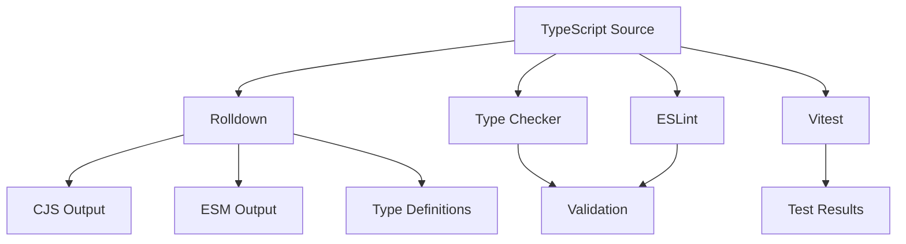
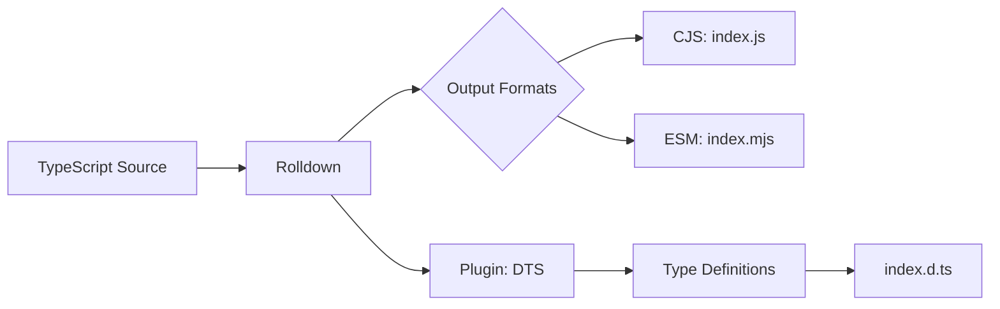

# lib-rolldown - Complete Documentation

## 📑 Table of Contents

- [Project Overview](#-project-overview)
- [Core Features](#-core-features)
- [Architecture](#-architecture)
- [Development Guide](#-development-guide)
- [Available Scripts](#-available-scripts)
- [Configuration](#-configuration)
- [Testing](#-testing)
- [Build & Deployment](#-build--deployment)
- [Best Practices](#-best-practices)
- [Troubleshooting](#-troubleshooting)
- [Contributing](#-contributing)
- [License](#-license)

## 🎯 Project Overview

### What is lib-rolldown?

**lib-rolldown** is a production-ready TypeScript library template built with [Rolldown](https://rolldown.rs/), the next-generation bundler written in Rust. It provides extreme build performance, dual-format output (CJS + ESM), and complete type generation, enabling you to rapidly develop and publish high-quality npm packages.

### Why Choose lib-rolldown?

- **Extreme Performance**: Rolldown delivers Rust-level compilation speed
- **Rollup Compatible**: Uses Rollup's plugin API while being much faster
- **Modern Output**: Generates both CommonJS and ES Module formats
- **Type Safety**: Automatic TypeScript declaration file generation
- **Tree-shaking**: Optimized for minimal bundle size
- **Developer Experience**: Integrated testing, linting, and documentation tools
- **Future-proof**: Built on the foundation of modern bundling technology

### Use Cases

This template is ideal for:

- **npm Packages**: General-purpose JavaScript/TypeScript libraries
- **UI Components**: Reusable component libraries
- **Utilities**: Helper functions and utility libraries
- **SDK Development**: API clients and SDKs
- **Framework Plugins**: Extensions for existing frameworks

## ✨ Core Features

### 1. Rolldown Build System

**Rolldown** combines the best of both worlds:

- **Speed**: Rust-based bundler with exceptional performance
- **Compatibility**: Uses Rollup's plugin ecosystem
- **Modern**: Built for the future of JavaScript bundling
- **Optimization**: Advanced tree-shaking and code splitting

Build performance comparison:
- Development rebuild: ~5-10ms
- Production build: ~50-100ms (typical library)

### 2. Dual Format Output

Generate both module formats simultaneously:

```javascript
// CommonJS (dist/index.js)
module.exports = { /* your exports */ }

// ES Module (dist/index.mjs)
export { /* your exports */ }
```

### 3. TypeScript Declaration Generation

Automatic `.d.ts` file generation:

```typescript
// dist/index.d.ts
export declare function myFunction(): string;
export declare interface MyInterface {
  prop: string;
}
```

### 4. Tree-shaking Optimization

Optimized bundle configuration for minimal output:

```json
{
  "sideEffects": false,
  "exports": {
    ".": {
      "import": "./dist/index.mjs",
      "require": "./dist/index.js",
      "types": "./dist/index.d.ts"
    }
  }
}
```

### 5. Comprehensive Testing

**Vitest** provides modern testing capabilities:

- Fast test execution
- TypeScript support out of the box
- Coverage reports with Istanbul
- UI mode for interactive testing

### 6. Code Quality Tools

Pre-configured quality assurance:

- **ESLint**: Modern flat config format
- **Prettier**: Automatic code formatting
- **Husky**: Git hooks for pre-commit checks
- **lint-staged**: Run linters on staged files only

### 7. Documentation Site

Built-in VitePress documentation:

```bash
pnpm docs:dev     # Development server
pnpm docs:build   # Static site generation
pnpm docs:preview # Preview built site
```

## 🏗️ Architecture

### Technology Stack



### Project Structure

```
lib-rolldown/
├── src/                          # Source code
│   ├── index.ts                 # Library entry point
│   └── utils/                   # Utility modules
│       ├── index.ts            # Barrel export
│       └── demo/               # Demo utilities
│           ├── getDemoValue.ts
│           └── getDemoValue.spec.ts
│
├── dist/                        # Build output (gitignored)
│   ├── index.js                # CommonJS bundle
│   ├── index.mjs               # ESM bundle
│   └── index.d.ts              # Type definitions
│
├── types/                       # Intermediate types (gitignored)
│
├── test/                        # E2E tests
│   └── app.e2e-spec.ts
│
├── docs/                        # VitePress documentation
│   ├── README.md               # English docs
│   ├── README.zh-TW.md         # Chinese docs
│   └── api-examples.md         # API examples
│
├── rolldown.config.ts           # Rolldown configuration
├── tsconfig.json                # Base TypeScript config
├── tsconfig.build.json          # Build config
├── tsconfig.lib.json            # Library config
├── tsconfig.spec.json           # Test config
│
├── vitest.config.mts            # Unit test config
├── vitest.config.e2e.mts        # E2E test config
├── eslint.config.mjs            # ESLint config
│
└── package.json                 # Package manifest
```

### Module Architecture

The library follows a clean, modular structure:

1. **Entry Point** (`src/index.ts`): Main library exports
2. **Utilities** (`src/utils/`): Organized helper functions
3. **Tests**: Co-located spec files with source code
4. **Type Definitions**: Automatically generated from source

### Build Process



## 🛠️ Development Guide

### Environment Setup

#### Prerequisites

1. **Install Node.js**:
   ```bash
   # Using nvm (recommended)
   nvm install 18
   nvm use 18
   
   # Or download from nodejs.org
   ```

2. **Install pnpm**:
   ```bash
   npm install -g pnpm@10.24.0
   ```

3. **Verify Installation**:
   ```bash
   node --version  # Should be >=18
   pnpm --version  # Should be >=10.24.0
   ```

#### Project Setup

1. **Clone or Create Project**:
   ```bash
   # If using as template
   degit royfw/rfjs/templates/libs/lib-rolldown my-library
   cd my-library
   ```

2. **Install Dependencies**:
   ```bash
   pnpm install
   ```

3. **Verify Setup**:
   ```bash
   pnpm typecheck  # Check TypeScript
   pnpm lint       # Check code style
   pnpm test       # Run tests
   ```

### Development Workflow

#### 1. Library Development

```bash
# Create feature branch
git checkout -b feature/my-feature

# Start watch mode
pnpm dev

# Make changes to src/
# Tests run automatically
```

#### 2. Writing Library Code

Create well-documented, reusable functions:

```typescript
// src/utils/myFeature.ts

/**
 * Formats a string to title case
 * @param input - The string to format
 * @returns The formatted string in title case
 * @example
 * ```ts
 * titleCase('hello world') // 'Hello World'
 * ```
 */
export function titleCase(input: string): string {
  return input
    .toLowerCase()
    .split(' ')
    .map(word => word.charAt(0).toUpperCase() + word.slice(1))
    .join(' ');
}
```

#### 3. Writing Tests

Create comprehensive test coverage:

```typescript
// src/utils/myFeature.spec.ts

import { describe, it, expect } from 'vitest';
import { titleCase } from './myFeature';

describe('titleCase', () => {
  it('should convert to title case', () => {
    expect(titleCase('hello world')).toBe('Hello World');
  });
  
  it('should handle single words', () => {
    expect(titleCase('hello')).toBe('Hello');
  });
  
  it('should handle empty strings', () => {
    expect(titleCase('')).toBe('');
  });
  
  it('should handle mixed case input', () => {
    expect(titleCase('HeLLo WoRLd')).toBe('Hello World');
  });
});
```

#### 4. Exporting API

Use barrel exports for clean API:

```typescript
// src/index.ts
export * from './utils/myFeature';
export * from './utils/anotherFeature';

// Or selective exports
export { titleCase } from './utils/myFeature';
export type { MyInterface } from './types';
```

#### 5. Committing Changes

```bash
# Stage changes
git add .

# Commit using Commitizen
pnpm commit

# Or manual commit (must follow conventional format)
git commit -m "feat: add titleCase utility"
```

### Code Standards

#### TypeScript Configuration

Strict settings for maximum type safety:

```json
{
  "compilerOptions": {
    "strict": true,
    "noUnusedLocals": true,
    "noUnusedParameters": true,
    "noImplicitReturns": true,
    "noFallthroughCasesInSwitch": true
  }
}
```

#### ESLint Rules

Key rules for library development:

- No unused variables or imports
- Consistent type imports
- Explicit return types for public APIs
- No `any` types in public interfaces

#### Documentation Comments

Use JSDoc for all public APIs:

```typescript
/**
 * Brief description of the function
 * @param paramName - Description of parameter
 * @returns Description of return value
 * @throws {ErrorType} Description of when error is thrown
 * @example
 * ```ts
 * // Example usage
 * myFunction('example')
 * ```
 */
export function myFunction(paramName: string): ReturnType {
  // Implementation
}
```

## 📜 Available Scripts

### Development Scripts

#### `pnpm dev`

Start development mode with watch and type-checking:

```bash
pnpm dev
```

Features:
- Automatic rebuild on file changes
- Parallel type-checking
- Source maps enabled

#### `pnpm dev:rolldown`

Pure Rolldown watch mode:

```bash
pnpm dev:rolldown
```

Fastest option for active development.

### Build Scripts

#### `pnpm build`

Production build with Rolldown:

```bash
pnpm build
```

Output:
- `dist/index.js` - CommonJS bundle
- `dist/index.mjs` - ES Module bundle
- `dist/index.d.ts` - Type definitions

Build includes:
- Minification
- Tree-shaking
- Source maps
- Type generation

#### `pnpm clean`

Remove all build artifacts:

```bash
pnpm clean

# Or clean specific directories
pnpm clean:dist   # Remove dist/
pnpm clean:types  # Remove types/
```

### Testing Scripts

#### `pnpm test`

Run all unit tests:

```bash
pnpm test

# With coverage
pnpm vitest:run --coverage
```

#### `pnpm vitest`

Watch mode for tests:

```bash
pnpm vitest
```

#### `pnpm vitest:ui`

Launch Vitest UI:

```bash
pnpm vitest:ui
```

Interactive test explorer with visualization.

### Code Quality Scripts

#### `pnpm lint`

Check code style:

```bash
pnpm lint

# Auto-fix issues
pnpm lint:fix
```

#### `pnpm typecheck`

Verify TypeScript types:

```bash
pnpm typecheck

# Watch mode
pnpm typecheck:watch
```

### Documentation Scripts

#### `pnpm docs:dev`

Start documentation server:

```bash
pnpm docs:dev
# Opens at http://localhost:5173
```

#### `pnpm docs:build`

Build static documentation:

```bash
pnpm docs:build
# Output in docs/.vitepress/dist
```

## ⚙️ Configuration

### Rolldown Configuration

The `rolldown.config.ts` file configures the build:

```typescript
import { defineConfig } from 'rolldown';
import dts from 'rollup-plugin-dts';
import copy from 'rollup-plugin-copy';

export default defineConfig([
  // Main build configuration
  {
    input: 'src/index.ts',
    output: [
      {
        file: 'dist/index.js',
        format: 'cjs',
        sourcemap: true,
      },
      {
        file: 'dist/index.mjs',
        format: 'esm',
        sourcemap: true,
      },
    ],
    external: ['tslib'],
  },
  // Type definitions
  {
    input: 'src/index.ts',
    output: {
      file: 'dist/index.d.ts',
      format: 'es',
    },
    plugins: [dts()],
  },
]);
```

Key configuration options:

- **input**: Entry point(s) for your library
- **output**: Format and location of output files
- **external**: Dependencies not to bundle
- **plugins**: Rollup plugins for additional functionality

### TypeScript Configuration

#### Base Config (`tsconfig.json`)

```json
{
  "compilerOptions": {
    "target": "ES2020",
    "module": "ESNext",
    "lib": ["ES2020"],
    "declaration": true,
    "declarationMap": true,
    "sourceMap": true,
    "outDir": "./dist",
    "rootDir": "./src",
    "strict": true,
    "esModuleInterop": true,
    "skipLibCheck": true,
    "forceConsistentCasingInFileNames": true
  }
}
```

#### Library Config (`tsconfig.lib.json`)

Extends base config for library build:
- Includes only `src/` directory
- Excludes test files
- Enables declaration generation

#### Test Config (`tsconfig.spec.json`)

Includes test utilities and types:
- Vitest global types
- Test helper imports

### Package.json Configuration

Essential fields for npm publishing:

```json
{
  "name": "@yourscope/your-library",
  "version": "1.0.0",
  "description": "Your library description",
  "type": "module",
  "main": "./dist/index.js",
  "module": "./dist/index.mjs",
  "types": "./dist/index.d.ts",
  "exports": {
    ".": {
      "import": {
        "types": "./dist/index.d.ts",
        "default": "./dist/index.mjs"
      },
      "require": {
        "types": "./dist/index.d.ts",
        "default": "./dist/index.js"
      }
    }
  },
  "files": [
    "dist"
  ],
  "sideEffects": false,
  "keywords": ["your", "keywords"],
  "author": "Your Name",
  "license": "ISC"
}
```

### Vitest Configuration

#### Unit Tests (`vitest.config.mts`)

```typescript
import { defineConfig } from 'vitest/config';

export default defineConfig({
  test: {
    globals: true,
    environment: 'node',
    include: ['src/**/*.spec.ts'],
    coverage: {
      provider: 'istanbul',
      reporter: ['text', 'json', 'html'],
      include: ['src/**/*.ts'],
      exclude: ['src/**/*.spec.ts'],
    },
  },
});
```

#### E2E Tests (`vitest.config.e2e.mts`)

Separate configuration for end-to-end tests:
- Different test patterns
- May include built output
- Integration test scenarios

## 🧪 Testing

### Testing Strategy

#### Test Coverage Goals

- **Statements**: >80%
- **Branches**: >75%
- **Functions**: >80%
- **Lines**: >80%

#### Test Organization

```
src/
├── utils/
│   ├── myFeature.ts
│   └── myFeature.spec.ts      # Co-located unit tests
└── index.ts
test/
└── integration.e2e-spec.ts     # Integration tests
```

### Writing Unit Tests

Example unit test with multiple scenarios:

```typescript
// src/utils/calculator.spec.ts

import { describe, it, expect } from 'vitest';
import { add, subtract, multiply, divide } from './calculator';

describe('Calculator', () => {
  describe('add', () => {
    it('should add positive numbers', () => {
      expect(add(2, 3)).toBe(5);
    });
    
    it('should add negative numbers', () => {
      expect(add(-2, -3)).toBe(-5);
    });
    
    it('should handle zero', () => {
      expect(add(0, 5)).toBe(5);
      expect(add(5, 0)).toBe(5);
    });
  });
  
  describe('divide', () => {
    it('should divide numbers', () => {
      expect(divide(10, 2)).toBe(5);
    });
    
    it('should throw on division by zero', () => {
      expect(() => divide(10, 0)).toThrow('Division by zero');
    });
  });
});
```

### Writing E2E Tests

Example integration test:

```typescript
// test/library.e2e-spec.ts

import { describe, it, expect } from 'vitest';
import * as library from '../src/index';

describe('Library Integration', () => {
  it('should export all public APIs', () => {
    expect(library).toHaveProperty('myFunction');
    expect(library).toHaveProperty('MyClass');
  });
  
  it('should work in real-world scenario', () => {
    const result = library.myFunction('test');
    expect(result).toMatch(/expected pattern/);
  });
});
```

### Running Tests

```bash
# Run all tests
pnpm test

# Run specific test file
pnpm vitest run src/utils/calculator.spec.ts

# Run tests matching pattern
pnpm vitest run --grep "should add"

# Run with coverage
pnpm vitest run --coverage

# Watch mode
pnpm vitest

# UI mode
pnpm vitest:ui
```

### Test Coverage

Generate and view coverage reports:

```bash
# Generate coverage
pnpm vitest run --coverage

# Open HTML report
open coverage/index.html
```

Coverage report includes:
- Statement coverage
- Branch coverage
- Function coverage
- Line coverage
- Uncovered lines highlighted

## 🚀 Build & Deployment

### Building for Production

#### Standard Build

```bash
# Clean previous builds
pnpm clean

# Build library
pnpm build

# Verify build
node -e "console.log(require('./dist/index.js'))"
```

#### Build Output

After building, your `dist/` directory contains:

```
dist/
├── index.js          # CommonJS bundle
├── index.js.map      # CJS source map
├── index.mjs         # ES Module bundle
├── index.mjs.map     # ESM source map
└── index.d.ts        # Type definitions
```

### Publishing to npm

#### Preparation

1. **Update package.json**:
   ```json
   {
     "name": "@yourscope/your-library",
     "version": "1.0.0",
     "description": "Your library description"
   }
   ```

2. **Build and test**:
   ```bash
   pnpm build
   pnpm test
   ```

3. **Verify package contents**:
   ```bash
   npm pack --dry-run
   ```

#### Publishing

```bash
# Login to npm (first time)
npm login

# Publish public package
npm publish --access public

# Publish scoped package
npm publish
```

#### Version Management

```bash
# Patch release (1.0.0 -> 1.0.1)
npm version patch

# Minor release (1.0.0 -> 1.1.0)
npm version minor

# Major release (1.0.0 -> 2.0.0)
npm version major

# Then publish
npm publish
```

### CI/CD Integration

#### GitHub Actions Example

```yaml
name: Publish

on:
  release:
    types: [created]

jobs:
  publish:
    runs-on: ubuntu-latest
    steps:
      - uses: actions/checkout@v3
      - uses: pnpm/action-setup@v2
        with:
          version: 10.24.0
      - uses: actions/setup-node@v3
        with:
          node-version: 18
          registry-url: 'https://registry.npmjs.org'
      - run: pnpm install
      - run: pnpm test
      - run: pnpm build
      - run: npm publish
        env:
          NODE_AUTH_TOKEN: ${{ secrets.NPM_TOKEN }}
```

### Performance Optimization

#### Bundle Size

Monitor bundle size:

```bash
# Check bundle size
ls -lh dist/

# Analyze bundle
pnpm add -D rollup-plugin-visualizer
```

#### Tree-shaking

Ensure tree-shaking works:

```json
{
  "sideEffects": false
}
```

#### Code Splitting

For larger libraries, consider code splitting:

```typescript
// rolldown.config.ts
export default defineConfig({
  input: {
    index: 'src/index.ts',
    utils: 'src/utils/index.ts',
  },
  output: {
    dir: 'dist',
    format: 'esm',
  },
});
```

## 💡 Best Practices

### Library Design

#### 1. Small, Focused API

Keep your API surface small:

```typescript
// Good: Clear, focused exports
export { parse, stringify } from './json';
export type { ParseOptions, StringifyOptions } from './types';

// Avoid: Exposing internal implementation
// export * from './internal';
```

#### 2. Semantic Versioning

Follow semver strictly:

- **Patch** (1.0.X): Bug fixes
- **Minor** (1.X.0): New features, backward compatible
- **Major** (X.0.0): Breaking changes

#### 3. Deprecation Strategy

Deprecate gracefully:

```typescript
/**
 * @deprecated Use newFunction() instead. Will be removed in v2.0.0
 */
export function oldFunction() {
  console.warn('oldFunction is deprecated, use newFunction instead');
  return newFunction();
}
```

### Code Quality

#### 1. Type Safety

Avoid `any`, use proper types:

```typescript
// Bad
function process(data: any): any {
  return data;
}

// Good
function process<T>(data: T): T {
  return data;
}
```

#### 2. Error Handling

Provide clear error messages:

```typescript
export class LibraryError extends Error {
  constructor(
    message: string,
    public code: string,
    public context?: Record<string, unknown>
  ) {
    super(message);
    this.name = 'LibraryError';
  }
}

// Usage
throw new LibraryError(
  'Invalid configuration',
  'INVALID_CONFIG',
  { provided: config }
);
```

#### 3. Performance

Optimize hot paths:

```typescript
// Cache expensive operations
const cache = new Map();

export function expensiveOperation(key: string) {
  if (cache.has(key)) {
    return cache.get(key);
  }
  
  const result = /* expensive computation */;
  cache.set(key, result);
  return result;
}
```

### Documentation

#### 1. README

Essential sections:
- Installation
- Quick start
- API reference
- Examples
- Contributing

#### 2. API Documentation

Use JSDoc extensively:

```typescript
/**
 * Fetches user data from the API
 * @param userId - The unique identifier for the user
 * @param options - Optional fetch configuration
 * @returns Promise resolving to user data
 * @throws {LibraryError} When user is not found
 * @example
 * ```ts
 * const user = await fetchUser('123');
 * console.log(user.name);
 * ```
 */
export async function fetchUser(
  userId: string,
  options?: FetchOptions
): Promise<User> {
  // Implementation
}
```

#### 3. Changelog

Maintain CHANGELOG.md following [Keep a Changelog](https://keepachangelog.com/):

```markdown
# Changelog

## [1.1.0] - 2024-01-15

### Added
- New feature X
- Support for Y

### Fixed
- Bug with Z

### Changed
- Improved performance of A
```

## 🐛 Troubleshooting

### Common Issues

#### Build Errors

**Issue**: `Cannot find module '@/utils'`

**Solution**: Check path aliases in `tsconfig.json` and ensure Rolldown is configured to resolve them.

---

**Issue**: `Rolldown build failed`

**Solution**: Check `rolldown.config.ts` for syntax errors and ensure all plugins are properly installed.

#### Type Errors

**Issue**: `Type definitions not generated`

**Solution**: Verify `rollup-plugin-dts` is included in build configuration and check `tsconfig.lib.json` has `declaration: true`.

#### Test Failures

**Issue**: `Cannot import from built files in tests`

**Solution**: Tests should import from source, not dist. Check test configuration excludes dist files.

#### Publishing Issues

**Issue**: `403 Forbidden` when publishing

**Solution**: 
1. Verify npm authentication: `npm whoami`
2. Check package name availability
3. For scoped packages, ensure org access

### Debug Mode

Enable verbose logging:

```bash
# Rolldown debug
DEBUG=rolldown:* pnpm build

# npm debug
npm publish --loglevel verbose
```

### Getting Help

- Check [GitHub Issues](https://github.com/royfw/rfjs/issues)
- Review [Rolldown documentation](https://rolldown.rs/)
- Ask in project discussions

## 🤝 Contributing

### Development Setup

1. Fork and clone the repository
2. Install dependencies: `pnpm install`
3. Create a feature branch: `git checkout -b feature/my-feature`
4. Make your changes
5. Run tests: `pnpm test`
6. Build: `pnpm build`
7. Commit: `pnpm commit`
8. Push and create a Pull Request

### Code Review Guidelines

- Follow existing code style
- Add tests for new features
- Update documentation
- Keep commits atomic and well-described
- Ensure CI passes

### Release Process

Maintainers follow this process:

1. Update version: `npm version [patch|minor|major]`
2. Update CHANGELOG.md
3. Build: `pnpm build`
4. Test: `pnpm test`
5. Publish: `npm publish`
6. Push tags: `git push --follow-tags`
7. Create GitHub release

## 📄 License

This project is licensed under the ISC License.

---

**Created with** [rfjs/templates](https://github.com/royfw/rfjs)

For more templates, check out the [template collection](https://github.com/royfw/rfjs/tree/main/templates).