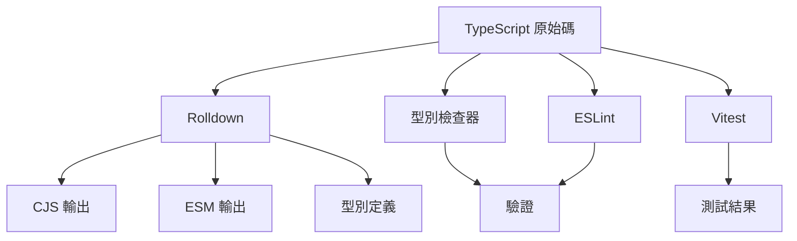
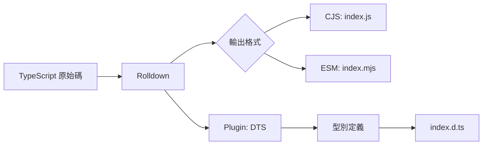

# lib-rolldown - 完整文檔

## 📑 目錄

- [專案概述](#-專案概述)
- [核心特性](#-核心特性)
- [架構設計](#-架構設計)
- [開發指南](#-開發指南)
- [可用指令](#-可用指令)
- [配置說明](#-配置說明)
- [測試](#-測試)
- [構建與部署](#-構建與部署)
- [最佳實踐](#-最佳實踐)
- [故障排除](#-故障排除)
- [貢獻指南](#-貢獻指南)
- [授權條款](#-授權條款)

## 🎯 專案概述

### 什麼是 lib-rolldown?

**lib-rolldown** 是一個使用 [Rolldown](https://rolldown.rs/) 構建的生產就緒 TypeScript 函式庫模板。Rolldown 是用 Rust 編寫的次世代打包工具,提供極致的構建效能、雙格式輸出(CJS + ESM)和完整的型別生成,使您能夠快速開發和發布高品質的 npm 套件。

### 為什麼選擇 lib-rolldown?

- **極致效能** - Rolldown 提供 Rust 級別的編譯速度
- **Rollup 相容** - 使用 Rollup 的 plugin API,但速度更快
- **現代輸出** - 同時生成 CommonJS 和 ES Module 格式
- **型別安全** - 自動生成 TypeScript 宣告檔案
- **Tree-shaking** - 優化最小化 bundle 大小
- **開發者體驗** - 整合測試、linting 和文檔工具
- **面向未來** - 建立在現代打包技術的基礎上

### 適用場景

此模板非常適合:

- **npm 套件** - 通用 JavaScript/TypeScript 函式庫
- **UI 元件** - 可重用元件庫
- **工具函式** - 輔助函式和工具庫
- **SDK 開發** - API 客戶端和 SDK
- **框架外掛** - 現有框架的擴充套件

## ✨ 核心特性

### 1. Rolldown 構建系統

**Rolldown** 結合了兩全其美的優點:

- **速度** - 基於 Rust 的打包工具,效能卓越
- **相容性** - 使用 Rollup 的 plugin 生態系統
- **現代化** - 為 JavaScript 打包的未來而建
- **優化** - 進階 tree-shaking 和程式碼分割

構建效能比較:
- 開發重建: ~5-10ms
- 生產構建: ~50-100ms (典型函式庫)

### 2. 雙格式輸出

同時生成兩種模組格式:

```javascript
// CommonJS (dist/index.js)
module.exports = { /* your exports */ }

// ES Module (dist/index.mjs)
export { /* your exports */ }
```

### 3. TypeScript 宣告生成

自動生成 `.d.ts` 檔案:

```typescript
// dist/index.d.ts
export declare function myFunction(): string;
export declare interface MyInterface {
  prop: string;
}
```

### 4. Tree-shaking 優化

為最小輸出優化的 bundle 配置:

```json
{
  "sideEffects": false,
  "exports": {
    ".": {
      "import": "./dist/index.mjs",
      "require": "./dist/index.js",
      "types": "./dist/index.d.ts"
    }
  }
}
```

### 5. 完整測試支援

**Vitest** 提供現代測試功能:

- 快速測試執行
- 開箱即用的 TypeScript 支援
- Istanbul 覆蓋率報告
- UI 模式用於互動式測試

### 6. 程式碼品質工具

預先配置的品質保證:

- **ESLint** - 現代 flat config 格式
- **Prettier** - 自動程式碼格式化
- **Husky** - Git hooks 用於 pre-commit 檢查
- **lint-staged** - 僅對暫存檔案執行 linter

### 7. 文檔網站

內建 VitePress 文檔:

```bash
pnpm docs:dev     # 開發伺服器
pnpm docs:build   # 靜態網站生成
pnpm docs:preview # 預覽構建的網站
```

## 🏗️ 架構設計

### 技術堆疊



### 專案結構

```
lib-rolldown/
├── src/                          # 原始碼
│   ├── index.ts                 # 函式庫入口點
│   └── utils/                   # 工具模組
│       ├── index.ts            # Barrel export
│       └── demo/               # 示範工具
│           ├── getDemoValue.ts
│           └── getDemoValue.spec.ts
│
├── dist/                        # 構建輸出 (gitignored)
│   ├── index.js                # CommonJS bundle
│   ├── index.mjs               # ESM bundle
│   └── index.d.ts              # 型別定義
│
├── types/                       # 中間型別 (gitignored)
│
├── test/                        # E2E 測試
│   └── app.e2e-spec.ts
│
├── docs/                        # VitePress 文檔
│   ├── README.md               # 英文文檔
│   ├── README.zh-TW.md         # 繁體中文文檔
│   └── api-examples.md         # API 範例
│
├── rolldown.config.ts           # Rolldown 配置
├── tsconfig.json                # 基礎 TypeScript 配置
├── tsconfig.build.json          # 構建配置
├── tsconfig.lib.json            # 函式庫配置
├── tsconfig.spec.json           # 測試配置
│
├── vitest.config.mts            # 單元測試配置
├── vitest.config.e2e.mts        # E2E 測試配置
├── eslint.config.mjs            # ESLint 配置
│
└── package.json                 # 套件清單
```

### 模組架構

函式庫遵循清晰的模組化結構:

1. **入口點** (`src/index.ts`) - 主要函式庫匯出
2. **工具** (`src/utils/`) - 組織化的輔助函式
3. **測試** - 與原始碼同位置的 spec 檔案
4. **型別定義** - 從原始碼自動生成

### 構建流程



## 🛠️ 開發指南

### 環境設置

#### 前置需求

1. **安裝 Node.js**:
   ```bash
   # 使用 nvm (推薦)
   nvm install 18
   nvm use 18
   
   # 或從 nodejs.org 下載
   ```

2. **安裝 pnpm**:
   ```bash
   npm install -g pnpm@10.24.0
   ```

3. **驗證安裝**:
   ```bash
   node --version  # 應該 >=18
   pnpm --version  # 應該 >=10.24.0
   ```

#### 專案設置

1. **複製或建立專案**:
   ```bash
   # 如果使用作為模板
   degit royfw/start-ts-templates/templates/lib-rolldown my-library
   cd my-library
   ```

2. **安裝依賴**:
   ```bash
   pnpm install
   ```

3. **驗證設置**:
   ```bash
   pnpm typecheck  # 檢查 TypeScript
   pnpm lint       # 檢查程式碼風格
   pnpm test       # 執行測試
   ```

### 開發工作流

#### 1. 函式庫開發

```bash
# 建立功能分支
git checkout -b feature/my-feature

# 啟動 watch 模式
pnpm dev

# 修改 src/ 中的程式碼
# 測試會自動執行
```

#### 2. 撰寫函式庫程式碼

建立有良好文檔的可重用函式:

```typescript
// src/utils/myFeature.ts

/**
 * 將字串格式化為標題大小寫
 * @param input - 要格式化的字串
 * @returns 標題大小寫格式的字串
 * @example
 * ```ts
 * titleCase('hello world') // 'Hello World'
 * ```
 */
export function titleCase(input: string): string {
  return input
    .toLowerCase()
    .split(' ')
    .map(word => word.charAt(0).toUpperCase() + word.slice(1))
    .join(' ');
}
```

#### 3. 撰寫測試

建立完整的測試覆蓋率:

```typescript
// src/utils/myFeature.spec.ts

import { describe, it, expect } from 'vitest';
import { titleCase } from './myFeature';

describe('titleCase', () => {
  it('應該轉換為標題大小寫', () => {
    expect(titleCase('hello world')).toBe('Hello World');
  });
  
  it('應該處理單字', () => {
    expect(titleCase('hello')).toBe('Hello');
  });
  
  it('應該處理空字串', () => {
    expect(titleCase('')).toBe('');
  });
  
  it('應該處理混合大小寫輸入', () => {
    expect(titleCase('HeLLo WoRLd')).toBe('Hello World');
  });
});
```

#### 4. 匯出 API

使用 barrel exports 提供乾淨的 API:

```typescript
// src/index.ts
export * from './utils/myFeature';
export * from './utils/anotherFeature';

// 或選擇性匯出
export { titleCase } from './utils/myFeature';
export type { MyInterface } from './types';
```

#### 5. 提交變更

```bash
# 暫存變更
git add .

# 使用 Commitizen 提交
pnpm commit

# 或手動提交 (必須遵循 conventional 格式)
git commit -m "feat: add titleCase utility"
```

### 程式碼標準

#### TypeScript 配置

嚴格設定以獲得最大型別安全:

```json
{
  "compilerOptions": {
    "strict": true,
    "noUnusedLocals": true,
    "noUnusedParameters": true,
    "noImplicitReturns": true,
    "noFallthroughCasesInSwitch": true
  }
}
```

#### ESLint 規則

函式庫開發的關鍵規則:

- 不允許未使用的變數或導入
- 一致的型別導入
- 公開 API 明確的回傳型別
- 公開介面不允許 `any` 型別

#### 文檔註解

為所有公開 API 使用 JSDoc:

```typescript
/**
 * 函式的簡短描述
 * @param paramName - 參數描述
 * @returns 回傳值描述
 * @throws {ErrorType} 何時拋出錯誤的描述
 * @example
 * ```ts
 * // 使用範例
 * myFunction('example')
 * ```
 */
export function myFunction(paramName: string): ReturnType {
  // 實作
}
```

## 📜 可用指令

### 開發指令

#### `pnpm dev`

啟動 watch 和型別檢查的開發模式:

```bash
pnpm dev
```

功能:
- 檔案變更時自動重建
- 並行型別檢查
- 啟用 source maps

#### `pnpm dev:rolldown`

純 Rolldown watch 模式:

```bash
pnpm dev:rolldown
```

活躍開發時最快的選項。

### 構建指令

#### `pnpm build`

使用 Rolldown 進行生產構建:

```bash
pnpm build
```

輸出:
- `dist/index.js` - CommonJS bundle
- `dist/index.mjs` - ES Module bundle
- `dist/index.d.ts` - 型別定義

構建包含:
- 壓縮
- Tree-shaking
- Source maps
- 型別生成

#### `pnpm clean`

移除所有構建產物:

```bash
pnpm clean

# 或清理特定目錄
pnpm clean:dist   # 移除 dist/
pnpm clean:types  # 移除 types/
```

### 測試指令

#### `pnpm test`

執行所有單元測試:

```bash
pnpm test

# 帶覆蓋率
pnpm vitest:run --coverage
```

#### `pnpm vitest`

測試 watch 模式:

```bash
pnpm vitest
```

#### `pnpm vitest:ui`

啟動 Vitest UI:

```bash
pnpm vitest:ui
```

互動式測試探索器,包含視覺化。

### 程式碼品質指令

#### `pnpm lint`

檢查程式碼風格:

```bash
pnpm lint

# 自動修復問題
pnpm lint:fix
```

#### `pnpm typecheck`

驗證 TypeScript 型別:

```bash
pnpm typecheck

# Watch 模式
pnpm typecheck:watch
```

### 文檔指令

#### `pnpm docs:dev`

啟動文檔伺服器:

```bash
pnpm docs:dev
# 在 http://localhost:5173 開啟
```

#### `pnpm docs:build`

構建靜態文檔:

```bash
pnpm docs:build
# 輸出在 docs/.vitepress/dist
```

## ⚙️ 配置說明

### Rolldown 配置

`rolldown.config.ts` 檔案配置構建:

```typescript
import { defineConfig } from 'rolldown';
import dts from 'rollup-plugin-dts';
import copy from 'rollup-plugin-copy';

export default defineConfig([
  // 主要構建配置
  {
    input: 'src/index.ts',
    output: [
      {
        file: 'dist/index.js',
        format: 'cjs',
        sourcemap: true,
      },
      {
        file: 'dist/index.mjs',
        format: 'esm',
        sourcemap: true,
      },
    ],
    external: ['tslib'],
  },
  // 型別定義
  {
    input: 'src/index.ts',
    output: {
      file: 'dist/index.d.ts',
      format: 'es',
    },
    plugins: [dts()],
  },
]);
```

關鍵配置選項:

- **input** - 函式庫的入口點
- **output** - 輸出檔案的格式和位置
- **external** - 不要打包的依賴
- **plugins** - Rollup plugins 用於額外功能

### TypeScript 配置

#### 基礎配置 (`tsconfig.json`)

```json
{
  "compilerOptions": {
    "target": "ES2020",
    "module": "ESNext",
    "lib": ["ES2020"],
    "declaration": true,
    "declarationMap": true,
    "sourceMap": true,
    "outDir": "./dist",
    "rootDir": "./src",
    "strict": true,
    "esModuleInterop": true,
    "skipLibCheck": true,
    "forceConsistentCasingInFileNames": true
  }
}
```

#### 函式庫配置 (`tsconfig.lib.json`)

擴展基礎配置用於函式庫構建:
- 僅包含 `src/` 目錄
- 排除測試檔案
- 啟用宣告生成

#### 測試配置 (`tsconfig.spec.json`)

包含測試工具和型別:
- Vitest 全域型別
- 測試輔助工具導入

### Package.json 配置

npm 發布的必要欄位:

```json
{
  "name": "@yourscope/your-library",
  "version": "1.0.0",
  "description": "Your library description",
  "type": "module",
  "main": "./dist/index.js",
  "module": "./dist/index.mjs",
  "types": "./dist/index.d.ts",
  "exports": {
    ".": {
      "import": {
        "types": "./dist/index.d.ts",
        "default": "./dist/index.mjs"
      },
      "require": {
        "types": "./dist/index.d.ts",
        "default": "./dist/index.js"
      }
    }
  },
  "files": [
    "dist"
  ],
  "sideEffects": false,
  "keywords": ["your", "keywords"],
  "author": "Your Name",
  "license": "ISC"
}
```

### Vitest 配置

#### 單元測試 (`vitest.config.mts`)

```typescript
import { defineConfig } from 'vitest/config';

export default defineConfig({
  test: {
    globals: true,
    environment: 'node',
    include: ['src/**/*.spec.ts'],
    coverage: {
      provider: 'istanbul',
      reporter: ['text', 'json', 'html'],
      include: ['src/**/*.ts'],
      exclude: ['src/**/*.spec.ts'],
    },
  },
});
```

#### E2E 測試 (`vitest.config.e2e.mts`)

端對端測試的獨立配置:
- 不同的測試模式
- 可能包含構建的輸出
- 整合測試場景

## 🧪 測試

### 測試策略

#### 測試覆蓋率目標

- **語句**: >80%
- **分支**: >75%
- **函式**: >80%
- **行數**: >80%

#### 測試組織

```
src/
├── utils/
│   ├── myFeature.ts
│   └── myFeature.spec.ts      # 同位置單元測試
└── index.ts
test/
└── integration.e2e-spec.ts     # 整合測試
```

### 撰寫單元測試

包含多個場景的單元測試範例:

```typescript
// src/utils/calculator.spec.ts

import { describe, it, expect } from 'vitest';
import { add, subtract, multiply, divide } from './calculator';

describe('Calculator', () => {
  describe('add', () => {
    it('應該正確地相加正數', () => {
      expect(add(2, 3)).toBe(5);
    });
    
    it('應該正確地相加負數', () => {
      expect(add(-2, -3)).toBe(-5);
    });
    
    it('應該處理零', () => {
      expect(add(0, 5)).toBe(5);
      expect(add(5, 0)).toBe(5);
    });
  });
  
  describe('divide', () => {
    it('應該正確地相除數字', () => {
      expect(divide(10, 2)).toBe(5);
    });
    
    it('應該在除以零時拋出錯誤', () => {
      expect(() => divide(10, 0)).toThrow('Division by zero');
    });
  });
});
```

### 撰寫 E2E 測試

整合測試範例:

```typescript
// test/library.e2e-spec.ts

import { describe, it, expect } from 'vitest';
import * as library from '../src/index';

describe('Library Integration', () => {
  it('應該匯出所有公開 API', () => {
    expect(library).toHaveProperty('myFunction');
    expect(library).toHaveProperty('MyClass');
  });
  
  it('應該在真實場景中運作', () => {
    const result = library.myFunction('test');
    expect(result).toMatch(/expected pattern/);
  });
});
```

### 執行測試

```bash
# 執行所有測試
pnpm test

# 執行特定測試檔案
pnpm vitest run src/utils/calculator.spec.ts

# 執行匹配模式的測試
pnpm vitest run --grep "應該相加"

# 帶覆蓋率執行
pnpm vitest run --coverage

# Watch 模式
pnpm vitest

# UI 模式
pnpm vitest:ui
```

### 測試覆蓋率

生成和查看覆蓋率報告:

```bash
# 生成覆蓋率
pnpm vitest run --coverage

# 開啟 HTML 報告
open coverage/index.html
```

覆蓋率報告包含:
- 語句覆蓋率
- 分支覆蓋率
- 函式覆蓋率
- 行數覆蓋率
- 未覆蓋的行數標示

## 🚀 構建與部署

### 生產構建

#### 標準構建

```bash
# 清理先前的構建
pnpm clean

# 構建函式庫
pnpm build

# 驗證構建
node -e "console.log(require('./dist/index.js'))"
```

#### 構建輸出

構建後,您的 `dist/` 目錄包含:

```
dist/
├── index.js          # CommonJS bundle
├── index.js.map      # CJS source map
├── index.mjs         # ES Module bundle
├── index.mjs.map     # ESM source map
└── index.d.ts        # 型別定義
```

### 發布到 npm

#### 準備

1. **更新 package.json**:
   ```json
   {
     "name": "@yourscope/your-library",
     "version": "1.0.0",
     "description": "Your library description"
   }
   ```

2. **構建和測試**:
   ```bash
   pnpm build
   pnpm test
   ```

3. **驗證套件內容**:
   ```bash
   npm pack --dry-run
   ```

#### 發布

```bash
# 登入 npm (首次)
npm login

# 發布公開套件
npm publish --access public

# 發布 scoped 套件
npm publish
```

#### 版本管理

```bash
# Patch 發布 (1.0.0 -> 1.0.1)
npm version patch

# Minor 發布 (1.0.0 -> 1.1.0)
npm version minor

# Major 發布 (1.0.0 -> 2.0.0)
npm version major

# 然後發布
npm publish
```

### CI/CD 整合

#### GitHub Actions 範例

```yaml
name: Publish

on:
  release:
    types: [created]

jobs:
  publish:
    runs-on: ubuntu-latest
    steps:
      - uses: actions/checkout@v3
      - uses: pnpm/action-setup@v2
        with:
          version: 10.24.0
      - uses: actions/setup-node@v3
        with:
          node-version: 18
          registry-url: 'https://registry.npmjs.org'
      - run: pnpm install
      - run: pnpm test
      - run: pnpm build
      - run: npm publish
        env:
          NODE_AUTH_TOKEN: ${{ secrets.NPM_TOKEN }}
```

### 效能優化

#### Bundle 大小

監控 bundle 大小:

```bash
# 檢查 bundle 大小
ls -lh dist/

# 分析 bundle
pnpm add -D rollup-plugin-visualizer
```

#### Tree-shaking

確保 tree-shaking 運作:

```json
{
  "sideEffects": false
}
```

#### 程式碼分割

對於較大的函式庫,考慮程式碼分割:

```typescript
// rolldown.config.ts
export default defineConfig({
  input: {
    index: 'src/index.ts',
    utils: 'src/utils/index.ts',
  },
  output: {
    dir: 'dist',
    format: 'esm',
  },
});
```

## 💡 最佳實踐

### 函式庫設計

#### 1. 小型、專注的 API

保持您的 API 表面小:

```typescript
// 良好: 清晰、專注的匯出
export { parse, stringify } from './json';
export type { ParseOptions, StringifyOptions } from './types';

// 避免: 暴露內部實作
// export * from './internal';
```

#### 2. 語意化版本控制

嚴格遵循 semver:

- **Patch** (1.0.X) - 錯誤修復
- **Minor** (1.X.0) - 新功能,向後相容
- **Major** (X.0.0) - 破壞性變更

#### 3. 棄用策略

優雅地棄用:

```typescript
/**
 * @deprecated 使用 newFunction() 代替。將在 v2.0.0 中移除
 */
export function oldFunction() {
  console.warn('oldFunction is deprecated, use newFunction instead');
  return newFunction();
}
```

### 程式碼品質

#### 1. 型別安全

避免 `any`,使用適當的型別:

```typescript
// 不良
function process(data: any): any {
  return data;
}

// 良好
function process<T>(data: T): T {
  return data;
}
```

#### 2. 錯誤處理

提供清晰的錯誤訊息:

```typescript
export class LibraryError extends Error {
  constructor(
    message: string,
    public code: string,
    public context?: Record<string, unknown>
  ) {
    super(message);
    this.name = 'LibraryError';
  }
}

// 使用
throw new LibraryError(
  'Invalid configuration',
  'INVALID_CONFIG',
  { provided: config }
);
```

#### 3. 效能

優化熱路徑:

```typescript
// 快取昂貴的操作
const cache = new Map();

export function expensiveOperation(key: string) {
  if (cache.has(key)) {
    return cache.get(key);
  }
  
  const result = /* 昂貴的計算 */;
  cache.set(key, result);
  return result;
}
```

### 文檔

#### 1. README

必要章節:
- 安裝
- 快速開始
- API 參考
- 範例
- 貢獻

#### 2. API 文檔

廣泛使用 JSDoc:

```typescript
/**
 * 從 API 獲取使用者資料
 * @param userId - 使用者的唯一識別碼
 * @param options - 可選的 fetch 配置
 * @returns 解析為使用者資料的 Promise
 * @throws {LibraryError} 當找不到使用者時
 * @example
 * ```ts
 * const user = await fetchUser('123');
 * console.log(user.name);
 * ```
 */
export async function fetchUser(
  userId: string,
  options?: FetchOptions
): Promise<User> {
  // 實作
}
```

#### 3. Changelog

維護 CHANGELOG.md 遵循 [Keep a Changelog](https://keepachangelog.com/):

```markdown
# Changelog

## [1.1.0] - 2024-01-15

### Added
- 新功能 X
- 支援 Y

### Fixed
- 修復 Z 的錯誤

### Changed
- 改進 A 的效能
```

## 🐛 故障排除

### 常見問題

#### 構建錯誤

**問題**: `Cannot find module '@/utils'`

**解決方案**: 檢查 `tsconfig.json` 中的路徑別名,並確保 Rolldown 配置為解析它們。

---

**問題**: `Rolldown build failed`

**解決方案**: 檢查 `rolldown.config.ts` 的語法錯誤,並確保所有 plugins 都已正確安裝。

#### 型別錯誤

**問題**: `Type definitions not generated`

**解決方案**: 驗證 `rollup-plugin-dts` 包含在構建配置中,並檢查 `tsconfig.lib.json` 有 `declaration: true`。

#### 測試失敗

**問題**: `Cannot import from built files in tests`

**解決方案**: 測試應從原始碼導入,而非 dist。檢查測試配置排除 dist 檔案。

#### 發布問題

**問題**: 發布時出現 `403 Forbidden`

**解決方案**: 
1. 驗證 npm 認證: `npm whoami`
2. 檢查套件名稱可用性
3. 對於 scoped 套件,確保組織存取權限

### 除錯模式

啟用詳細日誌:

```bash
# Rolldown 除錯
DEBUG=rolldown:* pnpm build

# npm 除錯
npm publish --loglevel verbose
```

### 尋求協助

- 查看 [GitHub Issues](https://github.com/royfw/start-ts-templates/issues)
- 查閱 [Rolldown 文檔](https://rolldown.rs/)
- 在專案討論區發問

## 🤝 貢獻指南

### 開發設置

1. Fork 並 clone 儲存庫
2. 安裝依賴: `pnpm install`
3. 建立功能分支: `git checkout -b feature/my-feature`
4. 進行變更
5. 執行測試: `pnpm test`
6. 構建: `pnpm build`
7. 提交: `pnpm commit`
8. 推送並建立 Pull Request

### 程式碼審查指南

- 遵循現有的程式碼風格
- 為新功能新增測試
- 更新文檔
- 保持提交原子化且描述清楚
- 確保 CI 通過

### 發布流程

維護者遵循此流程:

1. 更新版本: `npm version [patch|minor|major]`
2. 更新 CHANGELOG.md
3. 構建: `pnpm build`
4. 測試: `pnpm test`
5. 發布: `npm publish`
6. 推送標籤: `git push --follow-tags`
7. 建立 GitHub release

## 📄 授權條款

本專案採用 ISC 授權條款。

---

**建立者** [start-ts-templates](https://github.com/royfw/start-ts-templates)

更多模板請查看 [模板集合](https://github.com/royfw/start-ts-templates/tree/main/templates)。